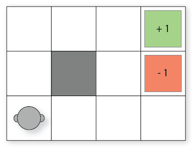

# Markov Decision Processes


**Chapter learning outcomes**

The learning outcomes of this chapter are:

1.  Identify situations in which Markov Decisions Processes (MDPs) are a
    suitable model of a problem

2.  Define 'Markov Decision Process'

3.  Compare MDPs to model of classical planning

4.  Explain how Bellman equations are solutions to MDP problems

## Overview

So far, we have looked at classical planning.
Classical planning tools can produce solutions quickly in large search
spaces; but assume:

-   Deterministic events

-   Environments change only as the result of an action

-   Perfect knowledge (omniscience)

-   Single actor (omnipotence)

Throughout the remainder of this subject, we are going to look at how to
relax a few of these assumptions, starting with the first: deterministic
events.

*Markov Decision Processes* (MDPs) remove the assumption of
deterministic events and instead assume that each action could have
multiple outcomes, with each outcome associated with a probability.

For example:

-   Flipping a coin has two outcomes: heads ($\frac{1}{2}$) and tails
    ($\frac{1}{2}$)

-   Rolling two dices together has twelve outcomes: 2 ($\frac{1}{36}$),
    3 ($\frac{1}{18}$), 4 ($\frac{3}{36}$), ..., 12 ($\frac{1}{36}$)

-   When trying to pick up an object with a robot arm, there could be
    two outcomes: successful ($\frac{4}{5}$) and unsuccessful
    ($\frac{1}{5}$)

MDPs have been successfully applied to planning in many domains: robot
navigation, planning which areas of a mine to dig for minerals,
treatment for patients, maintenance scheduling on vehicles, and many
others.

:::{admonition} Definition
Discounted Reward Markov Decision Processes

MDPs are **fully observable, probabilistic** state models. The most
common formulation of MDPs is a *Discounted-Reward* Markov Decision
Process:

-   a state space $S$

-   initial state $s_0 \in S$

-   actions $A(s) \subseteq A$ applicable in each state $s \in S$

-   **transition probabilities** $P_a(s'|s)$ for $s \in S$ and
    $a \in A(s)$

-   **rewards** $r(s,a,s')$ positive or negative of transitioning from
    state $s$ to state $s'$ using action $a$

-   a **discount factor** $0 \leq \gamma < 1$
:::

What is different from classical planning? Four things:

-   The transition function is no longer deterministic. Each action has
    a probability of $P_a(s'|s)$ of ending in state $s'$ if $a$ is
    executed in the state $s$.

-   There are no goals. Each action receives a reward when applied. The
    value of the reward is dependent on the state in which it is
    applied.

-   There are no action costs. These are modelled as negative rewards.

-   We have a *discount factor*.

---

**Discounted rewards** The discount factor determines how much a future reward should be
discounted compared to a current reward.

For example, would you prefer \$100 today or \$100 in a year's time? We
(humans) often *discount* the future and place a higher value on
nearer-term rewards.

In an MDP, a discount reward must be strictly less than 1. Later in this chapter, we will see why.

Assume our agent receives rewards $r_1, r_2, r_3, r_4, \ldots$ in that
order. If $\gamma$ is the discount factor, then the discounted reward
is:

$$
 \begin{array}{lll}
  V & = & r_1 + \gamma r_2 + \gamma^2 r_3 + \gamma^3 r_4 + \ldots\\
    & = & r_1 + \gamma(r_2 + \gamma(r_3 + \gamma(r_4 + \ldots)))
 \end{array}
$$

If $V_t$ is the value received at time-step $t$, then
$V_t = r_t + \gamma V_{t+1}$.


:::{admonition} Example -- Grid World
Our agent is in the bottom left cell of a grid. The grey square is a
wall. The two labelled cells give a *reward*: 1 for reaching the
top-right cell, but a negative reward of -1 for the cell immediately
below.




But! Things can go wrong --- sometimes the effects of the actions are
not what we want:

-   If the agent tries to move north, 80$\%$ of the time, this works as
    planned (provided the wall is not in the way)

-   10$\%$ of the time, trying to move north takes the agent west
    (provided the wall is not in the way);

-   10$\%$ of the time, trying to move north takes the agent east
    (provided the wall is not in the way)

-   If the wall is in the way of the cell that would have been taken,
    the agent stays put.
:::

:::{admonition} Example action
*Probabilistic PDDL* is one way to represent an MDP. It extends PDDL
with a few additional constructs. Of most relevance is that outcomes can
be associated with probabilities. The following describes the "Bomb and
Toilet" problem, in which one of two packages contains a bomb. The bomb
can be diffused by dunking it into a toilet, but there is a 0.05
probability of the bomb clogging the toilet.

```
(define (domain bomb-and-toilet)

    (:requirements :conditional-effects :probabilistic-effects)

    (:predicates (bomb-in-package ?pkg) (toilet-clogged) (bomb-defused))

    (:action dunk-package
     :parameters (?pkg)
     :effect (and (when (bomb-in-package ?pkg) (bomb-defused))
             (probabilistic 0.05 (toilet-clogged))))
:::

## Policies

The planning problem for discounted-reward MDPs is different to that of
classical planning because the actions are non-deterministic. Instead of
a sequence of actions, an MDP produces a *policy*.


:::{admonition} Definition
Policy
: A policy $\pi$ is a function that tells an agent which is the best
action to choose in each state. A policy can be *deterministic* or
*stochastic*.
:::


A *deterministic policy* $\pi : S \rightarrow A$ is a *mapping* from states to actions. It specifies which action to choose in every possible state. Thus, if we are in state $s$, our agent should choose the action defined by $\pi(s)$.
A graphical representation of the policy for Grid World is:

$$\begin{array}{|c|c|c|c|}
\hline
\rightarrow & \rightarrow & \rightarrow & +1\\
\hline
\uparrow &   & \uparrow  & -1\\
\hline
\uparrow & \leftarrow & \uparrow  & \leftarrow\\
\hline
\end{array}$$

So, in the initial state (bottom left cell), following this policy the
agent should go up.


Of course, agents do not work with graphical policies. The output from
an planner would look more like this:

```
at(0,0) => move_up
at(0,1) => move_up
at(0,2) => move_right
at(1,0) => move_left
at(1,2) => move_right
at(2,0) => move_up
at(2,2) => move_right
at(3,0) => move_left
```

where at(X, Y) is a proposition specifying that the agent is a coordinates (X,Y).

An agent can then parse this in and use it by determining what state it
is in, looking up the action for that state, and executing the action.
Then repeat.


A stochastic policy $\pi : S \times A \rightarrow \mathbb{R}$
specifies the *probability distribution* from which an agent should
select an action. Intuitively, $\pi(s,a)$ specifies the probability that
action $a$ should be executed in state $s$.

To execute a stochastic policy, we could just take the action with the
maximum $\pi(s,a)$. However, in many domains, it is better to select an
action based on the probability distribution; that is, choose the action
probablistically such that actions with higher probability are chosen
proportionally to their relative probabilities.

In this subject, we will focus only on deterministic policies, but
stochastic policies have their place.

## Solving MDPs

For discounted-reward MDPs, optimal solutions maximise the *expected
discounted accumulated reward* from the initial state $s_0$. But what is
the expected discounted accumulated reward?

In Discounted Reward MDPs, the **expected discounted reward from $s$** is

$$
V^{\pi}(s) = E_{\pi}[\, \sum_{i} \gamma^i \, r(a_i,s_i) \ | \ s_0 = s, a_i = \pi(s_i)]\,
$$

Thus, $V^{\pi}(s)$ defines the expected value of following the policy
$\pi$ from state $s$.

So for our Grid World example, assuming only the -1 and +1 states have
rewards, the expected value is:

$$
\begin{array}{lll}
   & \gamma^5 \times 1 \times (0.8^5) & \textrm{(optimal movement)}\\
 + &  \gamma^7 \times 1 \times (0.8^7) & \textrm{(first move only fails)}\\
 + & \ldots                             \textrm{(etc.)}
\end{array}
$$


Bellman equations (Discounted-Reward MDPs)
------------------------------------------

The *Bellman equations*, identified by Richard Bellman, describe the
condition that must hold for a policy to be optimal. It generalises to
problems other than MDPs, but we consider only MDPs here.

For discounted-reward MDPs the Bellman equation is defined recursively
as:
$$V(s) = \max_{a \in A(s)} \sum_{s' \in S} P_a(s'|s)\ [r(s,a,s') + \gamma\  V(s') ]$$
Thus, $V$ is optimal **if** for all states $s$, $V(s)$ describes the
total discounted reward for taking the action with the highest reward
over an indefinite/infinite horizon.

The reward of an action is: the sum of the immediate reward for all
states possibly resulting from that action plus the discounted future
reward of those states; times the probability of that action occurring.

Bellman equations -- An Alternate Formulation
---------------------------------------------

Sometimes, Bellman equations are described slightly differently, using
what is known as $Q$-functions.

If $V(s)$ is the expected value of being in state $s$ and acting
optimally according to our policy, then we can also describe the
*Q-value* of being in a state $s$, choosing action $a$ and then acting
optimally according to our policy as:

For discounted-reward MDPs the Bellman equation is defined recursively
as:
$$Q(s,a) = \sum_{s' \in S} P_a(s'|s)\ [r(s,a,s') + \gamma\  V(s') ]$$
This is just the expression inside the $\max$ expression in the Bellman
equation. Using this, sometimes you may see the Bellman equation then
defined as: $$V(s) = \max_{a \in A(s)} Q(s,a)$$ The two definitions are
equivalent, but you may seem them defined in both ways. However, when we
move onto reinforcement learning later, we will use $Q$ functions more
explicitly.
