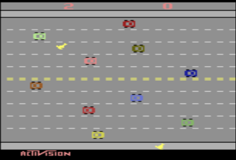

---
jupytext:
  text_representation:
    extension: .md
    format_name: myst
kernelspec:
  display_name: Python 3
  language: python
  name: python3
---
(sec:qfunction-approximation)=
# Q-function approximation

````{margin}
```{admonition} Video byte: Introduction to Q-function approximation
<iframe width="248" height="141" src="https://www.youtube.com/embed/OgBe6Ka-KHc?start=0s" title="Q-function approximation" frameborder="1" allow="accelerometer; autoplay; clipboard-write; encrypted-media; gyroscope; picture-in-picture" allowfullscreen></iframe>
```
````

```{admonition}  Learning outcomes
The learning outcomes of this chapter are:

1.  Manually apply linear Q-function approximation to solve small-scall MDP problems given some known features
    
2.  Select suitable features and design & implement Q-function approximation for model-free reinforcement learning techniques to solve medium-scale MDP problems automatically
    
3.  Argue the strengths and weaknesses of function approximation approaches
    
4.  Compare and contrast linear Q-learning with deep Q-learning
```

## Overview
Using a Q-table has two main limitations:

1. It requires that we visit every reachable state many times and apply every action many times to get a good estimate of $Q(s,a)$. Thus, if we never visit a state $s$, we have no estimate of $Q(s,a)$, even if we have visited states that are very similar to $s$.

2. It requires us to maintain a table of size $|A| \times |S|$, which is prohibitively large for any non-trivial problem.


To get around these we will look at how to use machine learning to approximate Q-functions. In particular, we will look at **linear function approximation** and approximation using **deep learning** (deep Q-learning). Instead of calculating an exact Q-function, we approximate it using simple methods that both eliminate the need for a large Q-table (therefore the methods scale better), and also allowing use to provide reasonable estimates of $Q(s,a)$ *even if we have not applied action $a$ in state $s$ previously*. 

:::{admonition} Example --- Freeway
Conside the game *Freeway*, in which a kangaroo needs to cross several lanes on a freeway without being run over by a car. A screenshot of the game is shown below:



Let us assume that there are 12 rows and about 40 columns. This grossly underestimates the actual number of rows and columns because the cars move a few pixels at a time, not in columns. This means there are 480 different positions that a kangaroo can be in, and there are two kangaroos. We also need to record whether there is a car in each location. 

This leads to:

$$480^2 \times  2^{480} \approx 7 \times 10^{149} \text{ states}$$ 

There are four actions: left, right, up, down.

A Q-table would need to store $28\times 10^{149}$ entries. This is a huge Q-table for what is a trivial example compared to many other problems.
:::

## Linear Q-learning (Linear Function Approximation) 

````{margin}
```{admonition} Video byte: Intuition of Q-function approximation
<iframe width="248" height="141" src="https://www.youtube.com/embed/OgBe6Ka-KHc?start=72" title="Q-function approximation" frameborder="1" allow="accelerometer; autoplay; clipboard-write; encrypted-media; gyroscope; picture-in-picture" allowfullscreen></iframe>
```
````

The key idea is to **approximate** the Q-function using a linear combination of **features** and their **weights**. Instead of recording everything in detail, we think about what is most important to know, and model that.

What are some features that are relevant to the Freeway example?

The overall process is:

1.  For the states, consider what are the features that determine its representation.

2.  During learning, perform updates based on the **weights of features** instead of states.

3.  Estimate $Q(s,a)$ by summing the features and their weights.


:::{admonition} Example --- Features for *Freeway*

Instead of recording the position of both kangaroos and whether there is a car in every position, we just record the following features:

- the number of rows each kangaroo is away from the other side of the road in (two features -- one for each kangaroo); and
- how far away the *closest* car is in the row above and below each kangaroo (four features --- two for each kangaroo).

This requires just six features. 
:::

### Linear Q-function Representation 

````{margin}
```{admonition} Video byte: Linear Q-function representation
<iframe width="248" height="141" src="https://www.youtube.com/embed/OgBe6Ka-KHc?start=405" title="Q-function approximation" frameborder="1" allow="accelerometer; autoplay; clipboard-write; encrypted-media; gyroscope; picture-in-picture" allowfullscreen></iframe>
```
````

In linear Q-learning, we store features and weights, not states. What we need to learn is how important each feature is (its **weight**) for each action.

To represent this, we have two vectors:

1.  A **feature vector**, $f(s,a)$, which is a vector of $n \cdot |A|$
    different functions, where $n$ is the number of state features and
    $|A|$ the number of actions. Each function extracts the value of a
    feature for state-action pair $(s,a)$. We say $f_i(s,a)$ extracts
    the $i$th feature from the state-action pair $(s,a)$:

    $$f(s,a) = \begin{pmatrix} 
        f_1(s,a) \\
        f_2(s,a) \\
        \ldots\\
        f_{n \times |A|}(s,a) \\
        \end{pmatrix}$$

    In the Freeway example, we have a vector with six state features
    times four actions. The function $f_1(s,Up)$ returns value of the feature that represents the distance kangaroo 1 is away from the goal. The function $f_{3}(s, Up)$
     returns the distance to the nearest car in the row above the first kangaroo. 

2.  A **weight vector** $w$ of size $n \times |A|$: one weight for each
    feature-action pair. $w^a_i$ defines the weight of a feature $i$ for
    action $a$.

### Defining State-Action Features 

````{margin}
```{admonition} Video byte: Defining state-action features
<iframe width="248" height="141" src="https://www.youtube.com/embed/OgBe6Ka-KHc?start=1156" title="Q-function approximation" frameborder="1" allow="accelerometer; autoplay; clipboard-write; encrypted-media; gyroscope; picture-in-picture" allowfullscreen></iframe>
```
````

Often it is easier to just define features for states, rather than state-action pairs. The features are just a vector of $n$ functions of the form $f_i(s)$.

However, for most applications, the weight of a feature is related to the action. The weight of being one step away from the end in Freeway is different if we go Up to if we go Right.

It is straightforward to construct $n \times |A|$ state-pair features from just $n$ state features:

$$
f_{i,k}(s,a) = \Bigg \{
\begin{array}{ll}
 f_i(s) & \text{if } a=a_k\\
 0      & \text{otherwise}
 ~~~ 1 \leq i \leq n, 1 \leq k \leq |A|
 \end{array}
$$

This effectively results in $|A|$ different weight vectors:

$$
 f(s,a_1) = \begin{pmatrix} 
f_{1,a_1}(s,a) \\
f_{2,a_1}(s,a) \\
0\\
0\\
0\\
0\\
\ldots
\end{pmatrix}~~
f(s,a_2) = \begin{pmatrix} 
0\\
0\\
f_{1,a_2}(s,a) \\
f_{2,a_2}(s,a) \\
0\\
0\\
\ldots
\end{pmatrix}~~
f(s,a_3) = \begin{pmatrix} 
0\\
0\\
0\\
0\\
f_{1,a_3}(s,a) \\
f_{2,a_3}(s,a) \\
\ldots
\end{pmatrix}~~\ldots
$$

(sec:single-agent:q-function-approximation:linear-q-values)=
### Q-values from linear Q-functions
Give a feature vector $f$ and a weight vector $w$, the Q-value of a state is a simple linear combination of features and weights:

$$
\begin{array}{lll}
  Q(s,a) & = & f_1(s,a) \cdot w^a_1 + f_2(s,a)\cdot w^a_2 + \ldots  + f_{n}(s,a) \cdot w^a_n\\
         & = & \sum_{i=0}^{n} f_i(s,a) w^a_i
\end{array}
$$

In practice, we also multiple the feature vector for weights $w^b_n$ for all actions $b \neq a$, but as the feature values will be 0, we know that it does not influence the result.

:::{admonition} Example --- Approximate Q-function computation for Freeway

For the Freeway example, we would assume that moving up would give a better score than moving down, all else equal (that is, if the closest car in the next row up is the same distance away than the closest in the next row down). So, for state $s$ where the kangaroo is in row 1:

$$
\begin{array}{lll}
  Q(s,Up)   & = &  f_1(s,Up)\cdot 0.31  + \ldots + f_{6}(s,Up) \cdot 0.04
\end{array}
$$
:::

(sec:single-agent:q-function-approximation:linear-update)=
### Linear Q-function Update 

````{margin}
```{admonition} Video byte: Linear Q-function update
<iframe width="248" height="141" src="https://www.youtube.com/embed/OgBe6Ka-KHc?start=697" title="Q-function approximation" frameborder="1" allow="accelerometer; autoplay; clipboard-write; encrypted-media; gyroscope; picture-in-picture" allowfullscreen></iframe>
```
````

To use approximate Q-functions in reinforcement learning, there are two steps we need to change from the standard algorithsm: (1) initialisation; and (2) update.

For initialisation, initialise all weights to 0. Alternatively, you can try Q-function initialisation and assign weights that you think will be "good" weights.

For update, we now need to update the weights instead of the Q-table values. The update rule is now:

$\quad\quad$ For each state-action feature $i$\
$\quad\quad\quad\quad w^a_i \leftarrow w^a_i + \alpha \cdot \delta \cdot \ f_i(s,a)$

where $\delta$ depends on which algorithm we are using; e.g. Q-learning, SARSA.

As this is linear, it is therefore convex, so the weights will converge.

```{admonition} Note --- Q-value propagation
Note that this has the effect of updating Q-values to states that have never been visited! 

In Freeway, for example, if we receive our first reward by crossing the road (going Up from the final row), this will update the weight all features for Up, and now we have a Q-value for going Up from *any* position on the final row.
```

````{margin}
```{admonition} Video byte: Example --- Linear Q-function update for Freeway
<iframe width="248" height="141" src="https://www.youtube.com/embed/OgBe6Ka-KHc?start=937" title="Q-function approximation" frameborder="1" allow="accelerometer; autoplay; clipboard-write; encrypted-media; gyroscope; picture-in-picture" allowfullscreen></iframe>
```
````

```{admonition} Example --- Linear Q-function update for Freeway
Assume that all weights are 0, therefore, $Q(s,a) = 0$ for every state and action. Now, we receive the reward of 10 for getting to the other side of the road. If feature 6 has the value $\frac{r}{D}$, where $r$ is the current row and $D$ is the distance to the other side, then
we have:

$$
\begin{array}{lll}
  w^a_i & \leftarrow & w^a_i + \alpha[r + \gamma \max_{a'} Q(s',a') - Q(s,a)] f_i(s,a)\\
  w^{Up}_{6} & \leftarrow & 0 + 0.5[10 + 0.9 \times 0] \frac{10}{10}\\
              & = &5
\end{array}
$$

From this, we now can get an estimate of $Q(s,Up)$ from any state because we have some weights in our linear function. Those that are closer to the other size of the road will get a higher Q-value than those further away (all other things being equal).
```

### Implementation

To implement linear function approximation, we implement a new class that inherits from `QFunction` called `LinearQFunction`:

```{code-cell} ipython3
:load: '../python_code/linear_qfunction.py'
```

A linear Q-function is initialised with either some given weights or with a default weight for all weights. The `update` method does as outlined [above]((sec:single-agent:q-function-approximation:linear-q-values): updates each weight by adding $\delta \cdot f_i(s,a)$. Computing the Q-value implements the weighted sum outlined [above](sec:single-agent:q-function-approximation:linear-update).

### Example: Linear Q-function approximation on Gridworld

To use on an example, we need a feature extractor. The first thing we need to do is define some features for the task. As discussed above, feature engineering is not always straightforward. However, for the GridWorld task, it is reasonably clear that the distance from the goal cell is important. As such, we define three features here: 

1. The distance from the goal on the X-axis.
2. The distance from the goal on the Y-axis.
3. The total distance from the goal as a Manhattan distance.

As noted above, normalising features is important to ensure that they are in the same magnitude. So, given the current position $(x,y)$ as the state, we extract the values of the state features as follows:

1. $(x(s) + \epsilon) / (x(g) + \epsilon)$
2. $(y(s) + \epsilon) / (y(g) + \epsilon)$
1. $(x(g) - x(s) + y(g) - y(s) + \epsilon) / (x(g) + y(g) + \epsilon)$

where $x(s)$ and $y(s)$ return the x and y coordinates of the agent respectively, and $g$ is the goal state. These expressions normalise the feature values to the range $[0,1]$ by dividing by the goal state. The $\epsilon$ is some small value such as $0.01$ to ensure two things: (1) that we do not divide by 0 if the goal is at a coordinator where x or y are 0; and (2) that the state (0,0) has a non-zero value, otherwise there will be no Q-value for it.

Then, to extract state-action features, we need to define these as $f(s,a)$ is defined from $f(s)$ above.

We can implement these in a feature extractor class:

```{code-cell} ipython3
:load: '../python_code/feature_extractor.py'
```

```{code-cell} ipython3
:load: '../python_code/gridworld_feature_extractor.py'
```

Now, we just simply pass this as a feature extractor to our implementation of `LinearQFunction`, and use this as the Q-function instead of a Q-table:

```{code-cell} ipython3
from gridworld import GridWorld
from qlearning import QLearning
from linear_qfunction import LinearQFunction
from gridworld_feature_extractor import GridWorldFeatureExtractor
from q_policy import QPolicy
from multi_armed_bandit.epsilon_greedy import EpsilonGreedy

mdp = GridWorld()
features = GridWorldFeatureExtractor(mdp)
qfunction = LinearQFunction(features)
QLearning(mdp, EpsilonGreedy(), qfunction).execute()
policy = QPolicy(qfunction)
mdp.visualise_q_function(qfunction)
mdp.visualise_policy(policy)
```

We can see that this gives ok Q-values and an ok policy, but there are issues. In particular, if we are in cell (2,1), the policy directs us to go right to the terminal state that gives us a -1 reward! 

This is because our linear approximation learns one weight for going right, left, up, and down. Going right at the state $(2,2)$ is clearly good, so the weight will be learnt as positive, but every time an update is performed after the agent tranisitions from $(2,2)$ to the goal state $(3,2)$, the weight updates the value of $Q(s, Right)$ for all states $s$, including the state $(2,1)$. As such, we learn that going right at (2,1) is good when it is not.

The choice of features is key to solving the problem. We have defined features that assume there is just the goal in the top-right corner. However, this does not help us avoid the negative reward. 

We can solve this by improving our features using feature engineering. One way is to encode specific features that learn that we are e.g. in state $(2,1)$. Our learning algorithm will then learn that when this feature value is true, going right is a bad move. 

However, more of these features we engineer, the more domain knowledge we are encoding into our solution.

A more general to engineering features about specific states is to add two new features that are true (1) if and only if we are in the same column (or row respectively) as the goal:

```{code-cell} ipython3
:load: '../python_code/gridworld_better_feature_extractor.py'
```

If we now run this on the GridWorld, we get better results:

```{code-cell} ipython3
from gridworld_better_feature_extractor import GridWorldBetterFeatureExtractor

mdp = GridWorld()
features = GridWorldBetterFeatureExtractor(mdp)
qfunction = LinearQFunction(features)
linear_qlearning_rewards = QLearning(mdp, EpsilonGreedy(), qfunction).execute(episodes=2000)
policy = QPolicy(qfunction)
mdp.visualise_q_function(qfunction)
mdp.visualise_policy(policy)
```

However, this is still not perfect. As we see, the policy recommends going up in state (1,0), which runs straight into the blocked cell. This is the downside of using linear function approximation. While it comes with convergence guarantees, it will not produce optimal policies if the underlying problem is non-linear.

We could work around the above problem by adding two more features to avoid the blocked cells, but the more domain knowledge we require, the more effort we require in both engineering and maintenance. It is fine to encode domain knowledge, but eventually we end up encoding so much domain knowledge that we nearly encode the entire solution by hand. If it is feasible to encode the solution by hand, there is little point using reinforcement learning.

Is there much value using function approximation? Comparing the reward curves of tabular Q-learning and linear Q-function approximation, we see that the linear version converges to the optimal policy earlier, at about 350 episodes instead of about 600 for tabular Q-learning:

```{code-cell} ipython3
from qtable import QTable
mdp = GridWorld()
qfunction = QTable()
tabular_qlearning_rewards = QLearning(mdp, EpsilonGreedy(), qfunction).execute(episodes=2000)
```

```{code-cell} ipython3
from plot import Plot

Plot.plot_cumulative_rewards(
    ["Tabular Q-learning", "Linear Q-learning"],
    [tabular_qlearning_rewards, linear_qlearning_rewards]
)
```

### Example: Linear Q-function approximation on Contested Crossing

In the Contested Crossing example, a similar set of features to the Gridworld problem works: distance to the other side of the crossing. However, using only the distance ignores other important factors, such as the risk of being shot the amount of health remaining. For this example, we use four features: 

1. the (normalised) x-distance to the other side of the crossing;
2. the (normalised) y-distance to the other side of the crossing;
3. the health level; and
4. the (normalised) difference between the Manhattan distance to the other side of the crossing minus the amount of damage done to the ship. Intuitively, the amount of moves required to successfully cross interacts with the health remaining, so have these as separate features in a linear model will not capture this interaction.

This results in the following policy visualisation:


```{code-cell} ipython3
from qlearning import QLearning
from linear_qfunction import LinearQFunction
from ccross_feature_extractor import CCrossFeatureExtractor
from stochastic_q_policy import StochasticQPolicy
from multi_armed_bandit.epsilon_greedy import EpsilonGreedy
import contested_crossing


mdp = contested_crossing.ContestedCrossing()
features = CCrossFeatureExtractor(mdp)
qfunction = LinearQFunction(features)
QLearning(mdp, EpsilonGreedy(), qfunction).execute()
policy = StochasticQPolicy(qfunction)
mdp.visualise_as_image(
    policy=policy,
    mode=0,
    title="Low danger: {0}, High danger: {1}".format(mdp.low_danger,mdp.high_danger),
    plot=True
)
```

### Example -- Linear function approximation vs Q-tables

````{margin}
```{admonition} Video byte: Q-tables vs. linear Q-functions
<iframe width="248" height="141" src="https://www.youtube.com/embed/OgBe6Ka-KHc?start=1330" title="Q-function approximation" frameborder="1" allow="accelerometer; autoplay; clipboard-write; encrypted-media; gyroscope; picture-in-picture" allowfullscreen></iframe>
```
````

Below we see a comparison of how linear Q-functions update over time in Gridworld, compared to standard Q-tables. 

```{div} full-width
<div id="container" markdown="1" style="text-align: center;">
    
    <gif-player id="qtable_vs_linear_qlearning" width="900"></gif-player>
</div>
<p>
```


We can see that, even after a single update after episode 1, the values of the Up action are updated for all states.

### Challenges and tips

The key challenge in linear function approximation for Q-learning is the feature engineering: selecting features that are meaningful and helpful in learning a good Q function. As well as estimating the Q-values of each action in a state, it also has to estimate the value of future states. As with any machine learning problem, feature engineering requires some experimentation and a careful combination of art and science.

**Tip:** Note that to make analysis and debugging easier, our feature values can be **normalised** using e.g. min-max normalisation or mean normalisation. This ensures that was feature weight is of the same magnitude, which makes it easier to understand the relative effect between features.


(sec:function-approximation:deep-Q-learning)=
## Deep Q-learning

````{margin}
```{admonition} Video byte: Deep Q-function approximation
<iframe width="248" height="141" src="https://www.youtube.com/embed/OgBe6Ka-KHc?start=1576" title="Q-function approximation" frameborder="1" allow="accelerometer; autoplay; clipboard-write; encrypted-media; gyroscope; picture-in-picture" allowfullscreen></iframe>
```
````

The latest hype in reinforcement learning is all about the use of deep neural networks to approximate value and Q-functions. 

### Deep Q-function representation

In deep Q-learning, Q-functions are represented using deep neural networks. Instead of selecting features and training weights, we learn the parameters $\theta$ to a neural network. The Q-function is $Q(s,a; \theta)$, so takes the parameters as an argument.

This has the advantage (over linear Q-function approximation) that feature engineering is not required, the 'features' will be learnt as part of the hidden layers of the neural network. 

A further advantage is that states can be non-structured (or less structured), rather than using a factored state representation. This means that states can be images, videos (sequences of images), or unstructured text.

### Deep Q-function update

The update rule for deep Q-learning looks similar to that of updating a linear Q-function.

The deep reinforcement learning TD update is:

$$\theta \leftarrow \theta + \alpha \cdot \delta \cdot \nabla_{\theta} Q(s,a; \theta)$$

where $\nabla_{\theta} Q(s,a; \theta)$ is the **gradient** of the Q-function. In these notes, we will not cover how to calculate the gradient of the Q-function: there are many excellent text books that cover gradients, such as [Dive into Deep Learning](https://d2l.ai/).

### Implementation

Deep Q-learning is identical to tabular or linear Q-learning, except that we use a deep neural network to represent the Q-function instead of a Q-table or a linear equation.

In this implementation, we use  the [PyTorch deep learning framework](https://pytorch.org/). This is a not a framework specifically for reinforcement learning --- it is a general deep learning framework for production code, which means it is also suitable for reinforcement learning.

Using PyTorch, we create a sequential neural network with the following:
1. The first layer takes the state vector, so the input features are the features of the state. In the case of the GridWorld example, this would be just the x- and y-coordinates of the agent.
2. We have a hidden layer, with a default number of 64 hidden dimensions, but this is parameterised by the variable `hidden_dim` in the `__init__` constructor.
3. The third and final layer is the output layer, whose dimensionality is the same as the action space, so that each action has a Q-value associated with it.
3. We use a non-linear ReLU (rectified linear unit) between layers.

The input, hidden, and output layers are all `Linear` layers, which is the name for a dense (fully connected) layer in PyTorch. This just means that the layers each learn linear weights, and during inference, they feed these values forward to the next layer. The ReLU layers in between prevent values less than 0 from activating, creating non-linear effects between layers.

From this, we implement the `update` method, which uses the PyTorch implementation to update the network parameters $\theta$, rather than calculating the gradient itself. We could also get the gradient and update $\theta$, but using an off-the-shelf implementation allows us to take advantage of optimisations.

We also need to implement the `get_q_value` method to pass through the network to get our Q-values.

```{code-cell} ipython3
:load: "../python_code/deep_qfunction.py"
```

Note in this implementation that PyTorch does not support strings as values, so we need to encode action names and states as numbers.

We can now use this implementation by creating a standard Q-learning agent with a deep Q network as the Q function:

```{code-cell} ipython3
:load: "../python_code/tests/deep_qlearning_run.py"

```

Note the value of the learning rate $\alpha=1.0$. This is because the optimiser (called ADAM) that is used  in the PyTorch implementation handles the learning rate in the `update` method of the `DeepQFunction` implementation. Therefore, we do not need to multiply the TD value by the learning rate $\alpha$ as the ADAM optimiser already does this. By setting $\alpha=1.0$, this means that the learning rate is not used in the `update` method, except implicitly by the call to the optimiser.

````{margin}
```{admonition} Video byte: Linear Q-functions vs Deep Q-functions
<iframe width="248" height="141" src="https://www.youtube.com/embed/OgBe6Ka-KHc?start=1769" title="Q-function approximation" frameborder="1" allow="accelerometer; autoplay; clipboard-write; encrypted-media; gyroscope; picture-in-picture" allowfullscreen></iframe>
```
````

Below we see a comparison between deep Q-functions and linear Q-functions. 

```{div} full-width
<div id="container2" markdown="1" style="text-align: center;">
    
    <gif-player id="linear_qlearning_vs_deep_qlearning" width="900"></gif-player>
</div>
<p>
```

We can see that because parameters in the deep Q-function are randomly initialised, the Q-values are random, whereas we intialise linear weights to 0, so Q-values are all 0.

There is minimal difference between the two policies. Note though that even though the deep Q-function does not assume linearity, it still learns a poor policy in parts of the Q-function, such as in the bottom right state, in which it recommends going up instead of left. This is likely due to the neural network being too simple for this problem, and thus underfitting. We could improve this by adding an additional layer or adding more hidden parameters to the layers.

The main difference between the two is the linear Q-function approximation is guaranteed to converge to a global optima due to its convex loss function, whereas deep Q-function approximation has no such guarantees.

### Advantages and disadvantages


**Advantages** of deep Q-function approximation  (compared to linear Q-function approximation):

- **Feature selection**: We do not need to select features -- the 'features' will be learnt as part of the hidden layers of the neural network. 
- **Unstructured data**: The state $s$ can be less structured, such as images or sequences of images (video).

**Disadvantages**:

- **Convergence**: There are no convergence guarantees.
- **Data hungry**: Deep neural networks are more data hungry because they need to learn features as well as "the Q-function", so compared to a linear approximation with good features, learning good Q-functions can be  difficult. Large amounts of computation are often required.

Despite this, deep Q-learning  works remarkably well in some areas, especially for tasks that require vision (see the robotic arm grasping unknown objects).

## Strengths and Limitations of Q-function Approximation


````{margin}
```{admonition} Video byte: Strengths and limitations of Q-function approximation
<iframe width="248" height="141" src="https://www.youtube.com/embed/OgBe6Ka-KHc?start=1890" title="Q-function approximation" frameborder="1" allow="accelerometer; autoplay; clipboard-write; encrypted-media; gyroscope; picture-in-picture" allowfullscreen></iframe>
```
````

Approximating Q-functions using machine learning techniques such as linear functions or deep learning  has advantages and disadvantages.

**Advantages:**

-   Memory: More efficient representation compared with Q-tables because we only store weights/parameters for the Q-function, rather than the the $|A| \times |S|$ entries for a Q-table.

-   Q-value propagation: we do not need to apply action $a$ in state $s$ to get a value for $Q(s,a)$ because the Q-function generalises.

**Disadvantages:**

-   The Q-function is now only an approximation of the real Q-function: states that share feature values will have the same Q-value according to the Q-function, but the actual Q-value according to the (unknown) optimal Q-function may be different.


````{margin}
```{admonition} Video byte: Summary of Q-function approximation
<iframe width="248" height="141" src="https://www.youtube.com/embed/OgBe6Ka-KHc?start=2099" title="Q-function approximation" frameborder="1" allow="accelerometer; autoplay; clipboard-write; encrypted-media; gyroscope; picture-in-picture" allowfullscreen></iframe>
```
````
## Takeaways

```{admonition} Takeaways
-  We can scale reinforcement learning by **approximating Q-functions**, rather than storing complete Q-tables.

-  Using simple **linear methods** in which we select features and learn weights are effective and guarantee convergence.

-  **Deep Q-learning** offers an alternative in which we can learn a state representation, but requires more training data (more episodes) and has no convergence guarantees.
```

## Further Reading

- Chapter 9 (Approximate Solution Methods) of [Introduction to Reinforcement Learning, Sutton and
    Barto](https://incompleteideas.net/book/the-book-2nd.html)

- Deep Q-learning for Atari. This uses Convolutional Neural Networks (NN) to estimate $\mathcal{Q}(s,a)$. The input for the NN is the state, and the output is the estimated reward for each action. There are two papers worth reading on this:

  - [Human-level control through deep reinforcement learning](http://www.davidqiu.com:8888/research/nature14236.pdf). Mnih, V., et al. Nature 529 (2015).
  - [Playing Atari with Deep Reinforcement Learning](https://arxiv.org/pdf/1312.5602v1.pdf). Mnih, V., et al. arXiV: preprint arXiv:1312.5602 (2013).

-   Before AlphaGo there was TD-gammon, which was the first paper to
    combine reinforcement learning and neural networks:
    [TD-Gammon, A Self-Teaching Backgammon Program, Achieves Master-Level Play](http://www.aaai.org/Papers/Symposia/Fall/1993/FS-93-02/FS93-02-003.pdf), : AAAI Technical Report FS-93-02 (1993).
