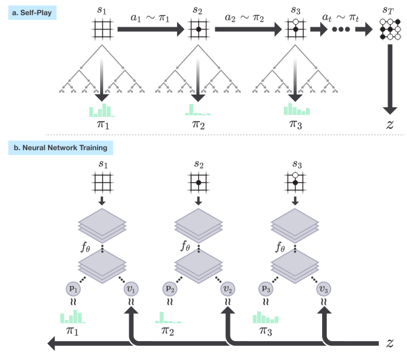

---
jupytext:
  text_representation:
    extension: .md
    format_name: myst
kernelspec:
  display_name: Python 3
  language: python
  name: python3
---

(sec:monte-carlo-tree-search)=
# Monte-Carlo Tree Search

## Learning Outcomes

1.  Explain the difference between offline and online planning for MDPs.
    
2.  Apply MCTS solve small-scale MDP problems manually and program MCTS algorithms to solve medium-scale MDP problems automatically
    
3.  Construct a policy from Q-functions resulting from MCTS algorithms

5.  Integrate multi-armed bandit algorithms (including UCB) to MCTS algorithms
    
6.  Compare and contrast MCTS to value iteration

6.  Discuss the strengths and weaknesses of the MCTS family of algorithms.

## Offline Planning & Online Planning for MDPs

We saw value iteration in the previous section. This is an *offline* planning method because we solve the problem offline for all possible states, and then use the solution (a policy) online to act. These offline planning methods derive a policy $\pi$ such that:

-   We can define policies that work from any state in a convenient manner.
    
-   Yet the state space $S$ is usually *far* too big to determine $V(s)$ or $\pi$ exactly.
    
-   There are methods to approximate the MDP by reducing the dimensionality of $S$, but we will not discuss these until later.

In *online* planning, planning is undertaken immediately before executing an action. Once an action (or perhaps a sequence of actions) is executed, we start planning again from the new state. As such, planning and execution are interleaved such that:

-   For each state $s$ visited, many policies $\pi$ are partially evaluated

-   The quality of each $\pi$ is approximated by averaging the expected reward of trajectories over $S$ obtained by repeated simulations of $r(s,a,s')$.
    
-   The chosen policy $\hat{\pi}$ is selected and the action $\hat{\pi}(s)$ executed.

The question is: how to we do the repeated simuations? *Monte Carlo* methods are by far the most widely-used approach.

## Overview

Monte Carlo Tree Search (MTCS) is a name for a *set* of algorithms all based around the same idea. Here, we will focus on using an algorithm for solving single-agent MDPs in a model-based manner. Later, we look at solving single-agent MDPs in a model-free manner and  multi-agent MDPs using MCTS.

*Monte Carlo* is an area within Monaco (small principality on the French riviera), which is best known for its extravagent casinos. As gambling and casinos are largely associated with chance, methods for solving MDPs online are often called *Monte Carlo* methods, because they use *randomness* to search the action space.


### Foundation: MDPs as ExpectiMax Trees

To get the idea of MCTS, we note that MDPs can be represented as trees (or graphs), called *ExpectiMax* trees:

```{figure} ./latex/mcts_expectimax.png
:name: expectimax

Abstract example of an ExpectiMax Tree
```

The letters $a$-$e$ represent actions, and letters $s$-$x$ represent states. White nodes are state nodes, and the small black nodes represent the probabilistic uncertainty: the 'environment' choosing which outcome from an action happens, based on the transition function.

### Monte Carlo Tree Search -- Overview

The algorithm is online, which means the action selection is interleaved with action execution. Thus, MCTS is invoked every time an agent visits a new state.

Fundamental features:

1.  The value $V(s)$ for each is approximated using *random simulation*.

2.  For a single-agent problem, an ExpectiMax *search tree* is built incrementally

3.  The search terminates when some pre-defined computational budget is used up, such as a time limit or a number of expanded nodes. Therefore, it is an *anytime* algorithm, as it can be terminated at any time and still give an answer.
    
4.  The best performing action is returned.
	-   This is complete if there are *no* dead--ends.
	-   This is optimal if an entire search can be performed (which is unusual -- if the problem is that small we should just use a dynamic programming technique such as  value iteration).

## The Framework: Monte Carlo Tree Search (MCTS)

The basic framework is to build up a tree using simulation. The states that have been evaluated are stored in a search tree. The set of evaluated states is *incrementally* built be iterating over the following four steps:

-   *Select*: Select a single node in the tree that is *not fully expanded*. By this, we mean at least one of its children is not yet explored.
    
-   *Expand*: Expand this node by applying one available action (as defined by the MDP) from the node.
    
-   *Simulation*: From one of the outcomes of the expanded, perform a complete random simulation of the MDP to a terminating state. This therefore assumes that the simulation is finite, but versions of MCTS exist in which we just execute for some time and then estimate the outcome.
    
-   *Backpropagate*: Finally, the value of the node is *backpropagated* to the root node, updating the value of each ancestor node on the way using expected value.

### Selection

Start at the root node, and successively select a child until we reach a node that is not fully expanded.

```{figure} ./latex/mcts_selection.png 
:name: mcts_selection

caption
```

### Expansion

Unless the node we end up at is a terminating state, expand the children of the selected node by choosing an action and creating new nodes using the action outcomes.

```{figure} ./latex/mcts_expansion.png 
:name: mcts_expansion

caption
```

### Simulation

Choose one of the new nodes and perform a random simulation of the MDP to the terminating state:

```{figure} ./latex/mcts_simulation.png 
:name: mcts_simulation

caption
```

### Backpropagation

Given the reward $r$ at the terminating state, *backpropagate* the reward to calculate the value $V(s)$ at each state along the path.

```{figure} ./latex/mcts_backpropagation.png 
:name: mcts_backpropagation

caption
```

## Algorithm

In a basic MCTS algorithm we incrementally build of the search tree. Each node in the tree stores:

1.  $V(s)$ (an estimate of the value of the state) for its state;
2.  a set of children nodes; and
3.  a pointer to their parent node.

:::{admonition} Algorithm -- Monte-Carlo Tree Search

**Input:** MDP $M = \langle S, s_0, A, P_a(s' \mid s), r(s,a,s')\rangle$, base value function $V$, time limit $T$.\
**Output:** selected action $a$

**while** $currentTime < T$\
$\quad\quad selected\_node \leftarrow \textrm{Select}(s_0)$\
$\quad\quad child \leftarrow \textrm{Expand}(selected\_node)$ -- expand and choose a child to simulate\
$\quad\quad reward \leftarrow \textrm{Simulate}(child)$ -- simulate from $child$\
$\quad\quad \textrm{Backpropagate}(selected\_node, child, reward)$\
**return** $\textrm{argmax}_{a} Q(s_0, a)$
:::

:::{admonition} Algorithm -- Monte-Carlo Tree Search

**Input:** MDP $M = \langle S, s_0, A, P_a(s' \mid s), r(s,a,s')\rangle$, base value function $V$, time limit $T$.\
**Output:** selected action $a$

**while** $currentTime < T$\
$\quad\quad$ $s \leftarrow s_0$\
$\quad\quad$ **while** $s$ is fully expanded\
$\quad\quad\quad\quad$ Select action $a$ to apply in $s$ using a multi-armed bandit algorithm\
$\quad\quad\quad\quad$ Execute $a$ in $s$ and observe new state $s'$\
$\quad\quad\quad\quad$ $s \leftarrow s'$\
$\quad\quad$ Select an action $a$ from $s$ to apply, and expand one outcome $s'$ according to the distribution $P_a(s' \mid s)$\
$\quad\quad$ $V(s') \leftarrow \textrm{simulate}(s')$ -- simulate from $s'$\
$\quad\quad$ **do**\
$\quad\quad\quad\quad$ $V(s) \leftarrow \max_{a\in A(s)} \Sigma_{s' \in children} P_a(s' \mid s) [r(s,a,s') + \gamma V(s')]$\
$\quad\quad\quad\quad$ $s \leftarrow $ parent of $s$\
$\quad\quad$ **while** $s \neq s_0$\
**return** $\textrm{argmax}_{a} Q(s_0, a)$ using policy extraction and $V(t)$ for each child $t$ of $s$
:::

Given this, there are four main parts to the algorithm above:

1. **Selection**: The first loop progressively selects a branch in the tree using a multi-armed bandit algorithm, calculating $Q(s,a)$ at each node using [policy extraction](sec:mdps:policy-extraction), getting the values of $V(t)$ for each child $t$ from the child node.

2. **Expansion**: Select an action $a$ to apply in  state$s$, either randomly or using an heuristic. Get an outcome state $s'$ from applying action $a$ in state $s$ according to the probability distribution $P(s' \mid s)$ defined in the MDP. Expand a new environment node and a new state node for that outcome.

3. **Simulation**: Perform a randomised simulation of the MDP until we reach a terminating state. That is, at each choice point, randomly select an possible action from the MDP, and use transition probabilities $P_a(s' \mid s)$ to choose an outcome for each action. Heuristics can be used to improve the random simulation by guiding it towards more promising states. $G$ is the cumulative discounted reward received from the simulation starting at $s'$ until the simulation terminates. 

   To avoid memory explosion, we discard all nodes generated from the simulation. In any non-trivial search, we are unlikely to ever need them again.

4. **Backpropagation**: The reward from the simulation is backpropagated from the selected node to its ancestors recursively. We must not forget the *discount factor*! For each state $s$, get the expected value of all actions from that node:

$$
V(s) \leftarrow \max_{a\in A(s)} \Sigma_{s' \in children} P_a(s' \mid s) [r(s,a,s') + \gamma V(s')]
$$

Does this look familiar? It is just the Bellman equation. This is why the tree is called an *ExpectiMax* tree:  we maximise the expected return, and this calculation is done over two layers.  The summation ($\Sigma_{s'\in S}$ ...) calculates the value of the small black nodes in the tree, while the maximisation ($\max_{a \in A(s)}$ ...) calculates the value of the large white nodes (the state nodes).

However, in most MCTS frameworks,  we do not use the Bellman equation at all. Instead, we calculate the value of a node as: 

$$
V(s) \leftarrow V(s) + (r(s,a,s') + \gamma G - V(s)) / N(s)
$$

where $G$ is the discounted future reward passed up from the child node during simulation and $N(s)$ is the number of times the state $s$ has been visited. This expression calculates $V(s)$ as a moving average. It does not use $P_a(s' \mid s)$, however, because we select actions using $P_a(s' \mid s)$, meaning that on average, state $s'$ will be selected from $s$ with probability $P_a(s' \mid s)$. The moving average will correspond to the Bellman equation given an infinite number of executions. 

:::{admonition} Example: Backpropagation

Consider the following ExpectiMax tree that has been expanded several times. Assume $\gamma=0.9$, $r=X$ represents reward $X$ received at a state, N is the number of times the
state has been visited, and the length of the simulation is 14. After the simulation step, but before backpropagation, our tree would look like this:

```{figure} ./latex/mcts_example.png
:name: mcts_example
```

In the next iteration, the red actions are selected, and the blue node is expanded to its three children nodes. A simulation is run from $y''$, which terminates after 14 steps. A reward of 100 is received in the terminal state. This would mean that the discounted reward returned at node $y''$ would be $\gamma^{13} \times 100$.

The backpropagation step is then calculated for the nodes $y''$, $t'$, and $s$ as follows:

$$
\begin{array}{lll}
  V(y'')  & = & \max_{a\in A(y'')} \sum_{s' \in children(y'')} P_a(s'|y'')\ [r(y'',a,s') + \gamma\  V(s') ]\\
          & = & \gamma^{13} \times 100~~\textrm{(simulation is 14 steps long and receives reward of 100)}\\
          & \approx &   25\\
  ~~\\
  V(t')   & = &  max_{a\in A(t')} \sum_{s' \in children(t')} P_a(s'|t')\ [r(t',a,s') + \gamma\  V(s') ]\\
          & = &  0.1(0+0) ~+~ 0.1(0+0) ~+~ 0.8(0 + 0.9 \times 25)\\
          & = &  18\\
 ~~\\
  V(s)    & = & \max_{a\in A(s)} \sum_{s' \in children(s)} P_a(s'|s)\ [r(s,a,s') + \gamma\  V(s') ]\\
          & = & \max(0.8(0 + 0.9 \times 12) + 0.2(7 + 0.9 \times 18),~~ \textrm{(action a)}\\
          &   & \quad\quad 0.5(0 + 0.9 \times 40) + 0.5(0 + 0.9 \times 20))~~ \textrm{(action b)}\\
          & = & \max(8.64 + 4.62,~ 18 + 9)\\
          & = & 27\\
\end{array}
$$


The new tree would look like this:

```{figure} ./latex/mcts_example_after_backprop.png
:name: mcts_example_after_backprop
```

The value of $V(s)$ does not change because action $b$ still returns the maximum discounted future reward.

:::

## Execution

Once we have run out of computational time, we select the action that maximises are expected return, which is simply the one with the highest Q-value from our simulations: 

$$\textrm{argmax}_{a \in A(s)} Q(s_0, a)$$ 

We execute that action and wait to see which outcome occurs for the action.

Once we see the outcome state, which we will call $s'$, we start the process all over again, except with $s_0 \leftarrow s'$.

However, importantly, we can *keep* the sub-tree from state $s'$, as we already have done simulations from that state. We discard the rest of the tree (all child of $s_0$ other than the chosen action) and incrementally build from $s'$.

## Upper Confidence Trees (UCT)

When we select nodes, we select using some [multi-armed bandit algorithm](sec:multi-armed-bandits). We can use any multi-armed bandit algorith, but in practice, using a slight variation of the UCB1 algorithm has proved to be successful in MCTS.

**Intuition**: actions $a$ applicable on $s$ are the "arms of the bandit", and $Q(s,a)$ corresponds to the random variables $X_{i,n}$. So, at each state, simply run a multi-armed bandit at that state.

The Upper Confidence Trees (UCT) algorithm  is the combination of MCTS with the UCB1 strategy for selecting the next node to follow:

$$UCT = MCTS + UCB1$$

The UCT selection strategy is similar to the UCB1 strategy:

$$\text{argmax}_{a \in A(s)} Q(s,a) + 2 C_p \sqrt{\frac{2 \ln N(s)}{N(s,a)}}$$

$N(s)$ is the number of times a state node has been visited, and $N(s,a)$ is the number of times $a$ has been selected from this node. $C_p >0$ is the exploration constant, which determines can be increased to encourage more exploration, and decreased to encourage less exploration. Ties are broken randomly.

If $Q(s,a) \in [0,1]$ and $C_p=\frac{1}{\sqrt{2}}$ then in two-player zero-sum, UCT converges to the well-known Minimax algorithm.

## Simulation-based MCTS

**What if we do not know $P_a(s' \mid s)$ or r(s, a, s')?**

We can use MCTS if we do not know our transition probabilities or our reward function, provided that we can *simulate* them; e.g. using a code-based simulator. Note that this is not a *model-free* approach: we still need a model in the form of a simulator, but we do not need to have explicit tranisition and reward functions.

The new approach is a straightforward modification:

1.  *Selection* is as before.

2.  In the *expansion* step, instead of expanding all child nodes of an action, we run the simulation forward one step, which will choose one outcome according to $P(s' \mid s)$ (provided the simulator is accurate), even though we cannot "see"  $P(s' \mid s)$.

3.  We then simulate as before, and we learn the rewards when we receive them from the simulator.

4.  In the *backpropagation* step, instead of using the Bellman equation to calculate the expected return, we simply use the *average* return. If we simulate each step enough times, the average will converge to the expected return.

The advantage of this is that it is more general: as long as we have a simulator for our problem, we can apply it -- we do not need an explicit model of the problem. For many problem, simulators are easier to produce than problems.

(sec:mcts:implementation)=
## Implementation

Below is an implementation of MCTS in Python. This is a simulation-based implementation as it simulates outcomes and uses a moving average to calculate a value. However, the implementation keeps track of probabilities for the purpose of visualisation.

First, we create a class `Node`, which forms the basis for the tree:

```{code-cell} ipython3 
import math
import random
import time
from multi_armed_bandits import *

class Node():    

    # record a unique node id to distinguish duplicated states for visualisation
    nextNodeID = 0
    
    def __init__(self, mdp, parent, state):
        self.mdp = mdp  
        self.parent = parent
        self.state = state
        self.id = Node.nextNodeID
        Node.nextNodeID += 1

        # the value and the total visits to this node
        self.visits = 0
        self.value = 0.0

    '''
    Return the value of this node
    '''
    def getValue(self):
        return self.value
```

In our single-agent MCTS problem, we have two nodes in an ExpectiMax tree: nodes representing states, and nodes representing `choice points' for the environment (that is, the filled nodes that correspond to an action outcome). 

Our implementation mirrors this, with two different classes for nodes: `StateNode` and `EnvironmentNode`. The children of a `StateNode` are all `EnvironmentNode` instances, and vice versa.

For simplicity, we implement the select, expand, and backpropagate methods in these two node classes:

```{code-cell} ipython3
class StateNode(Node):
    
    def __init__(self, mdp, parent, state, reward = 0, probability = 1.0, bandit = UpperConfidenceBounds()):
        super().__init__(mdp, parent, state)
        
        # a dictionary from actions to an environment node
        self.children = {}

        # the reward received for this state
        self.reward = reward
        
        # the probability of this node being chosen from its parent
        self.probability = probability

        # a multi-armed bandit for this node
        self.bandit = bandit

    '''
    Return true if and only if all child actions have been expanded
    '''
    def isFullyExpanded(self):
        validActions = self.mdp.getActions(self.state)
        if len(validActions) == len(self.children):
            return True
        else:
            return False

    def select(self):
        if not self.isFullyExpanded():
            return self
        else:
            actions = list(self.children.keys())    
            qValues = dict()
            for action in actions:
                #get the Q values from all outcome nodes
                qValues[action] = self.children[action].getValue()
            bestAction = self.bandit.select(actions, qValues)
            return self.children[bestAction].select()

    def expand(self):
        #randomly select an unexpanded action to expand
        actions = self.mdp.getActions(self.state) - self.children.keys()
        action = random.choice(list(actions))

        #choose an outcome
        newChild = EnvironmentNode(self.mdp, self, self.state, action)
        newStateNode = newChild.expand()
        self.children[action] = newChild
        return newStateNode

    def backPropagate(self, reward):
        self.visits += 1
        self.value = self.value + ((self.reward + reward - self.value) / self.visits) 
        
        if self.parent != None:
            self.parent.backPropagate(reward)

    def getQFunction(self):
        qValues = {}
        for action in self.children.keys():
            qValues[(self.state, action)] = round(self.children[action].getValue(), 3)
        return qValues

class EnvironmentNode(Node):
    
    def __init__(self, mdp, parent, state, action):
        super().__init__(mdp, parent, state)
        self.outcmes = {}
        self.action = action
        
        # a set of outcomes
        self.children = []

    def select(self):
        # choose one outcome based on transition probabilities
        (newState, reward) = self.mdp.execute(self.state, self.action)

        #find the corresponding state
        for child in self.children:
            if newState == child.state:
                return child.select()

    def addChild(self, action, newState, reward, probability):
        child = StateNode(self.mdp, self, newState, reward, probability)
        self.children += [child]
        return child

    def expand(self):
        # choose one outcome based on transition probabilities
        (newState, reward) = self.mdp.execute(self.state, self.action)

        # expand all outcomes
        selected = None
        transitions = self.mdp.getTransitions(self.state, self.action)
        for (outcome, probability) in transitions:
            newChild = self.addChild(self.action, outcome, reward, probability)
            # find the child node correponding to the new state
            if outcome == newState:
                selected = newChild
        return selected

    def backPropagate(self, reward):
        self.visits += 1
        self.value = self.value + ((reward - self.value) / self.visits)
        self.parent.backPropagate(reward * self.mdp.getDiscountFactor())
```

Once these are implemented, the MCTS class is quite straightforward. It simply implements the algorithm from above, and implements the simulation method:

```{code-cell} ipython3
class MCTS():

    def __init__(self, mdp):
        self.mdp = mdp

    '''
    Execute the MCTS algorithm from the initial state given, with timeout in seconds
    '''
    def mcts(self, timeout = 1):
        rootNode = StateNode(self.mdp, None, self.mdp.getInitialState())
        
        startTime = int(time.time() * 1000)
        currentTime = int(time.time() * 1000)
        while currentTime < startTime + timeout * 1000:
            # find a state node to expand
            selected\_node = rootNode.select()
            if not self.mdp.isTerminal(selected\_node):
                child = selected\_node.expand()
                reward = self.simulate(child)
                child.backPropagate(reward)
                
            currentTime = int(time.time() * 1000)

        return rootNode

    '''
        Choose a random action. Heustics can be used here to improve simulations.
    '''
    def choose(self, state):
        return random.choice(self.mdp.getActions(state))

    '''
        Simulate until a terminal state
    '''
    def simulate(self, node):
        state = node.state
        cumulativeReward = 0.0
        depth = 0
        while not self.mdp.isTerminal(state):
            #choose an action to execute
            action = self.choose(state)
            
            # execute the action
            (newState, reward) = self.mdp.execute(state, action)

            # discount the reward 
            cumulativeReward += pow(self.mdp.getDiscountFactor(), depth) * reward
            depth += 1

            state = newState
            
        return cumulativeReward
```

We can visualise one of our MCTS trees to demonstrate another issue with this vanilla MCTS algorithm. Here, we execute for just 0.01 seconds (to avoid a tree that is too large to visualise), we show the tree (open in a new tab to see a larger version):

```{code-cell} ipython3
---
tags: [hide-cell]
---
from mcts import *

from graphviz import Digraph

class GraphVisualisation():

    def __init__(self, maxLevel = 3):
        self.maxLevel = maxLevel

    def singleAgentMCTSToGraph(self, stateNode, filename='mcts'):
        g = Digraph('G', filename=filename, format='png')
        self.stateNodeToGraph(g, stateNode, level = 0)
        return g

    def stateNodeID(self, stateNode):
        return "V(" + str(stateNode.state) + "." + str(stateNode.id) + ") = " + str(round(stateNode.getValue(), 3)) +\
               "\\nN = " + str(stateNode.visits)

    def environmentNodeID(self, environmentNode):
        return "V(" + str(environmentNode.id) + ") = " + str(round(environmentNode.getValue(), 3)) +\
               "\\nN = " + str(environmentNode.visits)
    
    def stateNodeToGraph(self, g, stateNode, level):
        for action in stateNode.children.keys():
            g.edge(self.stateNodeID(stateNode), self.environmentNodeID(stateNode.children[action]), action)

        if level <= self.maxLevel:
            for action in stateNode.children.keys():
                self.environmentNodeToGraph(g, stateNode.children[action], level)

    def environmentNodeToGraph(self, g, environmentNode, level):
        for child in environmentNode.children:
            g.node(self.environmentNodeID(environmentNode), self.environmentNodeID(environmentNode), style='filled', shape='point', width='0.25')
            g.edge(self.environmentNodeID(environmentNode), self.stateNodeID(child), str(child.probability))
            
        for child in environmentNode.children:
            self.stateNodeToGraph(g, child, level + 1)
```

```{code-cell} ipython3
from gridworld import *
mdp = GridWorld()
rootNode = MCTS(mdp).mcts(timeout=0.01)
gv = GraphVisualisation(maxLevel = 2)
g = gv.singleAgentMCTSToGraph(rootNode, filename = 'mcts')
g
```

In this tree, the expression $(x, y).z$ represents the $(x,y)$ state with the unique identify $z$ for the node. 

The MCTS tree example shows weakness: the same state expanded multiple times, and will continue to be expanded. We can work around this by not expanding states that have already been visited. We can work around this by simply returning $V(s)$ as the reward for any expanded state, and not expanding it any more. For systems where repeated states are not an issue; e.g. some games, this problem does not arise.

Next, we execute this MCTS algorithm on the GridWorld problem for 1 second and print the corresponding Q-function for the initial state:

```{code-cell} ipython3
mdp = GridWorld()
rootNode = MCTS(mdp).mcts()
print(rootNode.getQFunction())
```
What we notice is that after 1 second, the rewards are quite noisy. This makes sense. First, early random simulations are (a bit) more likely to terminate in the -1 state because it is four actions away from the initial state, while the +1 goal state is five actions away. Second, because the an agent can go back to previous states, the random simulations end up long and get a very small discounted reward. Finally, there is actually very little difference from the start node between going left, up, and down: moving down or left from the initial state transitions back to the initial state with probability 0.9, so the difference between the three actions on average is just the discount factor.

(sec:monte-carlo-tree-search:demo)=
## Why does it work so well (sometimes)?

It addresses exploitation vs. exploration comprehensively.

-   UCT is *systematic*:

    -   Policy evaluation is *exhaustive* up to a certain depth.

    -   Exploration aims at *minimising regret*.

Watch it playing Mario brothers. The lines in front of Mario illustrate the exploration:

<p align="center">
<iframe width="560" height="315" src="https://www.youtube.com/embed/HRiEUUC9TUA" title="YouTube video player" frameborder="0" allow="accelerometer; autoplay; clipboard-write; encrypted-media; gyroscope; picture-in-picture" allowfullscreen></iframe>
</p>

Here is UCT doing very poorly playing a game of Freeway:

<p align="center">
<iframe width="560" height="315" src="https://www.youtube.com/embed/YVbTbMO4rtM" title="YouTube video player" frameborder="0" allow="accelerometer; autoplay; clipboard-write; encrypted-media; gyroscope; picture-in-picture" allowfullscreen></iframe>
</p>

It fails here because the character does not receive a reward until it reaches the other side of the road, so UCT has no feedback to go on. This is the same problem that we see in GridWorld: random simulations spend a lot of time exploring for no reward. In this case, the length of a path to reach a reward is so long that it does not even get to the other side of the road. Heuristics are needed here.

### Value iteration vs. MCTS

Often the set of states reachable from the initial state $s_0$ using an optimal policy is much smaller than the set of total states. In this regards, value iteration is exhaustive: it calculates behaviour from states that will never be encountered if we know the initial state of the problem.

MCTS (and other search methods) methods thus can be used by just taking samples starting at $s_0$. However, the result is not as general as using value/policy iteration: the resulting solution will work only from the known initial state $s_0$ or any state reachable from $s_0$ using actions defined in the model. Whereas value iteration  works from any state.


 |                       | **Value iteration**   |   **MCTS**     |
  :--------------------- | :--------------------------: | :-------------:
 | Cost                  | Higher cost (exhaustive)     |  Lower cost (does not solve for entire state space)
 | Coverage/ Robustness  | Higher (works from any state)| Lower (works only from initial state or state reachable from initial state)
 | |

This is important: value iteration is then more expensive for many problems, however, for an agent operating in its environment, we only solve exhaustively once, and we can use the resulting policy many times no matter state we are in latter.

For MCTS, we need to solve *online* each time we encounter a state we have not considered before. As we see, even for a simple problem like GridWorld, doing many rollouts in a one second interval does not lead to a good policy; but with some careful crafting of the algorithm (avoid duplicate states, use a heurist for rollouts), this can be improved.

## Combining MCTS and TD learning: Alpha Zero

Alpha Zero (or more accurately its predecessor AlphaGo) made headlines when it beat Go world champion Lee Sodol in 2016. It uses a combination of MCTS and (deep) reinforcement learning to learn a policy. 

A simple overview:

1.  AlphaZero uses a deep neural network to estimate the Q-function. More accurately, it gives an estimate of the probability of selecting action $a$ in state $s$ ($P(a|s)$), and the *value* of the state ($V(s)$), which represents the probability of the player winning from $s$.

2.  It is trained via *self-play*. Self-play is when the same policy is used to generate the moves of both the learning agent and any of its opponents. In  AlphaZero, this means that initially, both players make random moves, but both also learn the same policy and use it to select subsequent moves.

3.  At each move, AlphaZero:

    1.  Executes an MCTS search using UCB-like selection: $Q(s,a) + P(s,a)/1+N(s,a)$,
        which returns the probabilities of playing each move.

    2.  The neural network is used to guide the MCTS by influencing
        $Q(s,a)$.

    3.  The final result of a simulated game is used as the reward for
        each simulation.

    4.  After a set number of MCTS simulations, the best move is chosen
        for self-play.

    5.  Repeat steps 1-4 for each move until the self-play game ends.

    6.  Then, feedback the result of the self-play game to update the
        $Q$ function for each move.

AlphaZero is best summarised using the following figure from the Alpha Zero Nature paper (2017):




## Summary

-   Monte Carlo Tree Search (MCTS) is an anytime search algorithm, especially good for stochastic domains, such as MDPs.

    - It can be used for model-based or simulation-based problems.
    - Smart selection strategies are *crucial* for good performance.

-   UCT is the combination of MCTS and UCB1, and is a successful algorithm on many problems.

## Further Reading

- Chapters 2 and 5 of *Reinforcement Learning: An Introduction, second edition*. Freely downloadable at  http://incompleteideas.net/book/the-book.html 

- [Mastering the Game of Go without Human Knowledge](https://discovery.ucl.ac.uk/id/eprint/10045895/1/agz_unformatted_nature.pdf). D. Silver, et al. Nature volume 550, pages 354–359 (2017)

-   [A Survey of Monte Carlo Tree Search Methods](http://citeseerx.ist.psu.edu/viewdoc/download?doi=10.1.1.297.3086&rep=rep1&type=pdf). Cameron Browne, Edward Powley, Daniel Whitehouse, Simon Lucas,  Peter I. Cowling, Philipp Rohlfshagen, Stephen Tavener, Diego Perez, Spyridon Samothrakis and Simon Colton. *IEEE Transactions on Computational Intelligence and AI in Games*, (4)1: 1-49, 2012
    
-   [Monte-Carlo Tree Search: A New Framework for Game AI](https://www.aaai.org/Papers/AIIDE/2008/AIIDE08-036.pdf).  Guillaume Chaslot, Sander Bakkes, Istvan Szita, and Pieter Spronck.  In *AIIDE*, 1-2, 2008.
