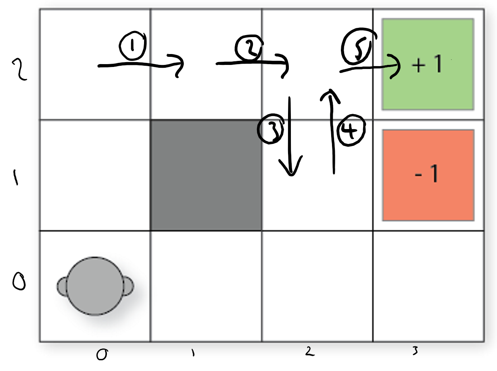

## $n$-step Reinforcement Learning: TD($\lambda$)

** Learning Outcomes**

1.  Manually apply n-step reinforcement learning approximation to solve
    small-scale MDP problems given a set of

2.  Design and implement n-step reinforcement learning to solve
    medium-scale MDP problems automatically

3.  Argue the strengths and weaknesses of n-step reinforcement learning

### Motivation

In the previous sections on of this chapter, we looked at two fundamental temporal
difference (TD) methods for reinforcement learning: Q-learning and
SARSA.

These two methods have some weaknesses in this basic format:

1.  Unlike Monte-Carlo methods, which reach a reward and then
    backpropagate this reward, TD methods use bootstrapping (they
    estimate the future discounted reward using $Q(s,a)$), which means
    that for problems with sparse rewards, it can take a long time to
    for rewards to propagate throughout a Q-function.

2.  Both methods estimate a Q-function $Q(s,a)$, and the simplest way to
    model this is via a Q-table. However, this requires us to maintain a
    table of size $|A| \times |S|$, which is prohibitively large for any
    non-trivial problem.

3.  Using a Q-table requires that we visit every reachable state many
    times and apply every action many times to get a good estimate of
    $Q(s,a)$. Thus, if we never visit a state $s$, we have no estimate
    of $Q(s,a)$, even if we have visited states that are very similar to
    $s$.

4.  Rewards can be sparse, meaning that there are few state/actions that
    lead to non-zero rewards. This is problematic because initially,
    reinforcement learning algorithms behave entirely randomly and will
    struggle to find good rewards. Remember the Freeway demo from the
    previous lecture?

To get around these limitations, we are going to look at *$n$-step temporal difference learning*: Monte Carlo techniques
    execute entire traces and then backpropagate the reward, while basic
    TD methods only look at the reward in the next step, estimating the
    future wards. $n$-step methods instead look $n$ steps ahead for the
    reward before updating the reward, and then estimate the remainder.

$n$-step TD learning comes from the idea used in the image below, from Sutton and Barto (2020). Monte
Carlo methods uses 'deep backups', where entire traces are executed and
the reward backpropagated. Methods such as Q-learning and SARSA use
'shallow backups', only using the reward from the 1-step ahead. $n$-step
learning finds the middle ground: only update the Q-function after
having explored ahead $n$ steps.

```{figure} ./figs/RL_approaches.png
:name: RL_approaches

Reinforcement learning approaches (from Sutton and Barto (2020))
```

### TD($\lambda$)

We will look at TD($\lambda$), in which $\lambda$ is the parameter that
determines $n$: the number of steps that we want to look ahead before
updating the Q-function. Thus, TD(0) is just 'standard' reinforcement
learning that we saw earlier in this chapter, and TD(1) looks one step beyond the immediate reward, TD(2) looks two steps beyond, etc.

Both Q-learning and SARSA have an $n$-step version. We will look at
TD($\lambda$) more generally, and then show an algorithm for $n$-step
SARSA. The version for Q-learning is similar.

#### Discounted Future Rewards (again)

When calculating a discounted reward over a trace, we simply sum up the rewards over the trace:

 $$ G_t   =   r_1 + \gamma r_2 + \gamma^2 r_3 + \gamma^3 r_4 + \ldots $$


We can re-write this as:

 $$ G_t =   r_1 + \gamma(r_2 + \gamma(r_3 + \gamma(r_4 + \ldots))) $$

If $G_t$ is the value received at time-step $t$, then 

 $$ G_t = r_t + \gamma G_{t+1} $$

In TD(0) methods such as Q-learning and SARSA, we do not know $G_{t+1}$
when updating $Q(s,a)$, so we estimate using bootstrapping:

 $$ G_t = r_t + \gamma \cdot V(s_{t+1}) $$ 

That is, the reward of the
entire future from step $t$ is estimated as the reward at $t$ plus the
estimated (discounted) future reward from $t+1$. $V(s_{t+1})$ is
estimated using the maximum expected return (Q-learning) or the
estimated value of the next action (SARSA).

This is a *one-step return*.

#### Truncated Discounted Rewards

However, we can estimate a two-step return:

$$ G^2_t = r_t + \gamma r_{t+1} + \gamma^3 V(s_{t+2}) $$ 

a three-step return:

$$ G^3_t = r_t + \gamma r_{t+1} + \gamma^2 r_{t+2} +  \gamma^3 V(s_{t+2}) $$

or $n$-step returns:

$$ G^n_t = r_t + \gamma r_{t+1} + \gamma^2 r_{t+2} + \ldots  \gamma^n V(s_{t+n}) $$

In this above expression $G^n_t$ is the full reward, *truncated* at $n$
steps, at time $t$. 

The basic idea of $n$-step reinforcement learning is that we do not update the Q-value
immediately after executing an action: we wait $n$ steps and update it
based on the $n$-step return.

If $T$ is the termination step and $t+n>T$, then we just use the full
reward.

In Monte-Carlo methods, we go all the way to the end of an episode.
Monte-Carlo Tree Search is one such Monte-Carlo method, but there are
others that we do not cover.

#### Updating the Q-function

The update rule is then different. First, we need to
calculate the truncated reward for $n$ steps, in which $\tau$ is the
time step that we are updating for (that is, $\tau$ is the action taken $n$ steps ago):

$$G \leftarrow \sum^{\min(\tau+n, T)}_{i=\tau+1}\gamma^{i-\tau-1}r_i$$

This just sums the discounted rewards from time step $\tau+1$ until either $n$
steps ($\tau+n$) or termination of the episode ($T$), whichever comes
first. 

Then calculate the $n$-step expected reward:

   $$\text{If } \tau+n < T \text{ then } G \leftarrow G + \gamma^n Q(S_{\tau+n}, A_{\tau+n}).$$

This adds the future expect reward if we are not at the
end of the episode (if $\tau+n < T$).

Finally, we update the Q-value:

   $$Q(S_{\tau}, A_{\tau}) \leftarrow  Q(S_{\tau}, A_{\tau}) + \alpha[G - Q(S_{\tau}, A_{\tau}) ]$$
 
In the update rule above, we are using a SARSA update, but a Q-learning update is similar.


### $n$-step SARSA

While conceptually this is not so difficult, an algorithm for doing $n$-step learning needs to store the rewards and observed states for $n$ steps, as well as keep track of which step to update. An algorithm for $n$-step SARSA is shown below.

:::{admonition} Algorithm -- $n$-step SARSA

**Input:** MDP $M = \langle S, s_0, A, P_a(s' \mid s), r(s,a,s')\rangle$\, number of steps $n$\
**Output:** Q-function $Q$

Initialise $Q$ arbitrary; e.g., $Q(s,a)=0$ for all $s$ and $a$

Repeat (for each episode)\
$\quad\quad$ $T \leftarrow \infty$\
$\quad\quad$ $t \leftarrow 0$  ($t$ is the current time step of this episode)\
$\quad\quad$ $s \leftarrow$ the first state in episode $e$\
$\quad\quad$ Select action $a$ to apply in $s$ using Q-values in $Q$ and a multi-armed bandit algorithm such as $\epsilon$-greedy\
$\quad\quad$ Repeat (for each step in episode $e)$\
$\quad\quad\quad\quad$ If $t < T$ then:\
$\quad\quad\quad\quad\quad\quad$ Execute action $a_t$ in state $s_t$\
$\quad\quad\quad\quad\quad\quad$ Observe and store reward $r_{t+1}$ and new state $s_{t+1}$\
$\quad\quad\quad\quad\quad\quad$ If $s_{t+1}$ is a terminal state then:\
$\quad\quad\quad\quad\quad\quad\quad\quad$ $T \leftarrow t + 1$\
$\quad\quad\quad\quad\quad\quad$ Else:\
$\quad\quad\quad\quad\quad\quad\quad\quad$ Select and store action $a_{t+1}$ to apply in $s_{t+1}$ using Q-values in $Q$ and a multi-armed bandit algorithm such as $\epsilon$-greedy\
$\quad\quad\quad\quad$ $\tau \leftarrow t - n + 1$  (calculate the index of the action to update)\
$\quad\quad\quad\quad$ If $\tau \geq 0$ then:\
$\quad\quad\quad\quad\quad\quad$ $G \leftarrow \sum^{\min(\tau+n, T)}_{i=\tau+1}\gamma^{i-\tau-1}r_i$\
$\quad\quad\quad\quad\quad\quad$ If $\tau+n < T$ then: $G \leftarrow G + \gamma^n Q(S_{\tau+n}, A_{\tau+n})$\
$\quad\quad\quad\quad\quad\quad$ $Q(S_{\tau}, A_{\tau}) \leftarrow  Q(S_{\tau}, A_{\tau}) + \alpha[G - Q(S_{\tau}, A_{\tau})]$\
$\quad\quad\quad\quad$ $t \leftarrow t + 1$\
$\quad\quad$ Until $t = T - 1$
:::

For the first $n-1$ steps of the any episode, we do not update $Q$ at
all; that is, if $\tau < 0$.

Also, we have to continue updating $n-1$ steps after the end of the
episode, but not selecting actions; that is, if $t \geq T$.

Computationally, this is not much worse than 1-step learning. We need to
store the last $n$ states, but the per-step computation is small and
uniform for n-step, just as for 1-step.

```{admonition} Example -- $n$-step SARSA update

Consider our simple 2D navigation task, in which we do not know
the probability transitions nor the rewards. Initially, the
reinforcement learning algorithm will be required to search randomly
until it finds a reward. Propagated this reward back $n$-steps will be
helpful.



Assuming $Q(s,a)=0$ for all $s$ and $a$, if we (finally) traverse the
episode the labelled episode, what will our Q-function look like for a
5-step update with $\alpha=0.5$ and $\gamma=0.9$?

We only receive a reward in the last action, and all other actions give
an immediate reward of 0 until then:

$$\begin{array}{lll}
  G   &  \leftarrow & \sum^{\min(\tau+n, T)}_{i=\tau+1}\gamma^{i-\tau-1}r_i\\ 
  G_1 &  \leftarrow & \gamma^1 \cdot 0 + \ldots + \gamma^5 \cdot 1\\    
      &  \leftarrow & 0.9^5 \cdot 1\\
      &  \leftarrow & 0.5905
\end{array}
$$

So, we update the Q-value for the state $(0,2)$, which is 5 steps back:

$$
\begin{array}{lll}
  Q((0,2),E) &  \leftarrow &  Q((0,2), E) + \alpha [G_1 - Q((0,2), E)]\\
             &  \leftarrow &  0 + 0.5 [0.5905 - 0]\\
             &  \leftarrow &  0.2953\\
\end{array}
$$

The tables below compares 1-step vs. 5-step SARSA
for the trace above. In 1-step SARSA, reaching the reward only informs
the state from which it is reached. Whereas for 5-step, it informs the
previous five steps. Then, in the next episode, there is more chance of
encountering a non-zero state, so which will again inform the five steps
instead of just one. The rewards 'spread' throughout the Q-table faster.

$$
\begin{array}{ccccc}
 & &  \textbf{1-step}\\
\hline
 \textbf{State} & North & South & East & West\\
\hline
 (0,0) & 0 & 0 & 0 & 0\\
 (0,1) & 0 & 0 & 0 & 0\\
 (0,2) & 0 & 0 & 0 & 0\\
  \ldots\\
 (1,2) & 0 & 0 & 0 & 0\\
 (2,1) & 0 & 0 & 0 & 0\\
 (2,2) & 0 & 0 & 0.45 & 0\\
 (2,3) & 0 & 0 & 0 & 0\\
 \ldots\\
\hline
\end{array}~~
\begin{array}{ccccc}
 & & \textbf{5-step}\\
\hline
 \textbf{State} & North & South & East & West\\
\hline
 (0,0) & 0 & 0 & 0 & 0\\
 (0,1) & 0 & 0 & 0 & 0\\
 (0,2) & 0 & 0 & 0.2953 & 0\\
  \ldots\\
 (1,2) & 0 & 0 & 0.3281 & 0\\
 (2,1) & 0.405 & 0 & 0 & 0\\
 (2,2) & 0 & 0.3645 & 0.45 & 0\\
 (2,3) & 0 & 0 & 0 & 0\\ 
 \ldots\\
\hline
\end{array}
$$

    


### Parameter selection

**TODO**

## Combining MCTS and TD: Alpha Zero

Alpha Zero (or more accurately its predecessor AlphaGo) made headlines
when it beat Go world champion Lee Sodol in 2016. It uses a combination
of MCTS and (deep) reinforcement learning to learn a policy. 

A simple overview:

1.  AlphaZero uses a deep neural network to estimate the Q-function. More
    accurately, it gives an estimate of the probability of selecting
    action $a$ in state $s$ ($P(a|s)$), and the *value* of the state
    ($V(s)$), which represents the probability of the player winning
    from $s$.

2.  It is trained via *self-play*. Self-play is when the same policy is used to generate the moves of both the learning agent and any of its opponents. In  AlphaZero, this means that initially, both players make random moves, but both also learn the same policy and use it to select subsequent moves.

3.  At each move, AlphaZero:

    1.  Executes an MCTS search using UCB-like selection: $Q(s,a) + P(s,a)/1+N(s,a)$,
        which returns the probabilities of playing each move.

    2.  The neural network is used to guide the MCTS by influencing
        $Q(s,a)$.

    3.  The final result of a simulated game is used as the reward for
        each simulation.

    4.  After a set number of MCTS simulations, the best move is chosen
        for self-play.

    5.  Repeat steps 1-4 for each move until the self-play game ends.

    6.  Then, feedback the result of the self-play game to update the
        $Q$ function for each move.

AlphaZero is best summarised using the following figure from the Alpha Zero Nature paper (2016):


Reading

-   Chapter 7 of *Introduction to Reinforcement Learning* \[*Sutton and
    Barto*\]

    Available at:

    <https://webdocs.cs.ualberta.ca/~sutton/book/the-book.html>

-   *Mastering the Game of Go without Human Knowledge* from DeepMind.

    Available at:

    <https://deepmind.com/documents/119/agz_unformatted_nature.pdf>
